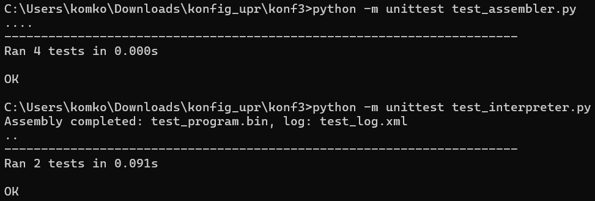

# Проект: Ассемблер и Интерпретатор

## Описание проекта

Данный проект состоит из двух основных компонентов:
1. **Ассемблер**: Преобразует текстовый ассемблерный код в бинарный формат, пригодный для выполнения интерпретатором.
2. **Интерпретатор**: Выполняет бинарные команды, манипулируя регистрами и памятью.

Проект предназначен для демонстрации базовых принципов работы с машинным кодом, такими как кодирование инструкций, выполнение команд, управление регистрами и памятью.

---

## Компоненты проекта

### Ассемблер (`assembler.py`)

Ассемблер выполняет следующие функции:
- Преобразует текстовые команды в бинарный формат.
- Логирует преобразование каждой команды.

#### Поддерживаемые команды

- **`LOAD <reg>, <const>`**  
  Загружает константу `<const>` в регистр `<reg>`.

- **`READ <reg>, <addr_reg>`**  
  Читает значение из памяти по адресу, которым является регистр по адресу, который указан в `<addr_reg>`, и записывает его в `<reg>`.

- **`WRITE <addr_reg>, <offset>, <reg>`**  
  Записывает значение из регистра `<reg>` в память по адресу, указанному в регистре по адресу `<addr_reg>` с учетом смещения `<offset>`.

- **`CMP_GE <reg>, <reg_1>, <reg_2>`**  
  Сравнивает значения регистров `<reg_1>` и `<reg_2>`. Если `<reg_2> >= <reg_1>`, записывает `1` в `<reg>`, иначе `0`.

#### Использование

Команда для запуска:
```bash
python assembler.py <input_file> <output_file> <log_file>
```
Где:
- `<input_file>` — входной файл с ассемблерным кодом.
- `<output_file>` — выходной бинарный файл.
- `<log_file>` — лог-файл с преобразованием команд.

---

### Интерпретатор (`interpreter.py`)

Интерпретатор выполняет бинарные команды, используя регистры и память.

#### Основные функции

- Выполнение команд, закодированных в бинарном формате.
- Управление 32 регистрами и памятью объемом 512 ячеек.
- Сохранение памяти в XML-формате после выполнения всех команд.

#### Использование

Команда для запуска:
```bash
python interpreter.py <binary_file> <result_file> <start> <end>
```
Где:
- `<binary_file>` — бинарный файл, сгенерированный ассемблером.
- `<result_file>` — XML-файл с результатами работы программы.
- `<start>` и `<end>` — диапазон адресов памяти для сохранения в XML.

---

### Тестирование

Тесты включают проверки для:
- Ассемблера: преобразование текстовых инструкций в бинарные данные.
- Интерпретатора: выполнение бинарного кода и сохранение результатов.

Тестовые файлы:
- `test_assembler.py` — проверяет корректность преобразования инструкций.
- `test_interpreter.py` — проверяет выполнение команд и сохранение памяти.

#### Запуск тестов

Для выполнения тестов используйте:
```bash
python -m unittest test_assembler.py
python -m unittest test_interpreter.py
```

---

## Сборка проекта

Для сборки проекта используйте:
```bash
python build.py
```

---

## Результаты тестов

- Ассемблер успешно преобразует команды в бинарный формат.
- Интерпретатор корректно выполняет команды и сохраняет память в XML-формате.
- Все тесты в `test_assembler.py` и `test_interpreter.py` пройдены успешно.




### Пример лога ассемблера
```
LOAD 0, 200 => 05 64 00 00 00
WRITE 14, 0, 0 => 72 00 00 00 00
LOAD 6, 131 => B5 41 00 00 00
READ 0, 10 => 01 05 00 00 00
CMP_GE 0, 6, 0 => 07 03 00 00 00
WRITE 10, 0, 0 => 52 00 00 00 00
```

### Пример результата интерпретатора
Фрагмент XML-файла `result.xml`:
```xml
<result>
    <memory addr="0">1</memory>
    <memory addr="1">0</memory>
    <memory addr="2">0</memory>
    <memory addr="3">0</memory>
    <memory addr="4">0</memory>
</result>
```

--- 

## Заключение

Проект демонстрирует основы работы с машинным кодом, предоставляя функциональные компоненты для преобразования и выполнения команд. Реализация тестов обеспечивает надежность и правильность работы обеих частей системы.
